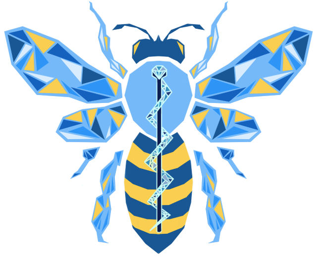
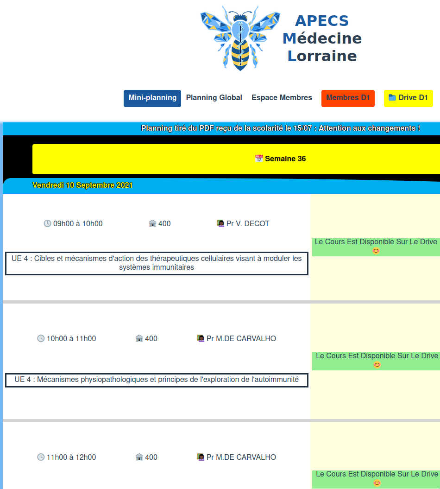

<!-- Improved compatibility of back to top link: See: https://github.com/othneildrew/Best-README-Template/pull/73 -->
<a name="readme-top"></a>
<!--
*** Thanks for checking out the Best-README-Template. If you have a suggestion
*** that would make this better, please fork the repo and create a pull request
*** or simply open an issue with the tag "enhancement".
*** Don't forget to give the project a star!
*** Thanks again! Now go create something AMAZING! :D
-->


<!-- PROJECT SHIELDS -->
<!--
*** I'm using markdown "reference style" links for readability.
*** Reference links are enclosed in brackets [ ] instead of parentheses ( ).
*** See the bottom of this document for the declaration of the reference variables
*** for contributors-url, forks-url, etc. This is an optional, concise syntax you may use.
*** https://www.markdownguide.org/basic-syntax/#reference-style-links
-->
[![Contributors][contributors-shield]][contributors-url]
[![Forks][forks-shield]][forks-url]
[![Stargazers][stars-shield]][stars-url]
[![Issues][issues-shield]][issues-url]
[![AGPLv3 license][license-shield]][license-url]


<!-- PROJECT LOGO -->
<br />
<div align="center">
  <a href="http://www.apecs.ml/">
    
  </a>

  <h3 align="center">ollaborative slot scheduling - APECS official website</h3>


  <p align="center">
This project is a web app for collaborative slot scheduling. See below for more details.
    <br />
    <a href="https://github.com/guatty/collaborative-slot-scheduler"><strong>Explore the docs »</strong></a>
    <br />
    <br />
    <a href="http://www.apecs.ml/">View Demo</a>
    ·
    <a href="https://github.com/guatty/collaborative-slot-scheduler/issues">Report Bug</a>
    ·
    <a href="https://github.com/guatty/collaborative-slot-scheduler/issues">Request Feature</a>
  </p>
</div>


## Table of Contents
  <ol>
    <li>
      <a href="#about-the-project">About The Project</a>
      <ul>
        <li><a href="#built-with">Built With</a></li>
      </ul>
    </li>
    <li>
      <a href="#getting-started">Getting Started</a>
      <ul>
        <li><a href="#prerequisites">Prerequisites</a></li>
      </ul>
    </li>
    <li><a href="#usage">Usage</a></li>
    <li><a href="#roadmap">Roadmap</a></li>
    <li><a href="#contributing">Contributing</a></li>
    <li><a href="#license">License</a></li>
    <li><a href="#contact">Contact</a></li>
    <li><a href="#acknowledgments">Acknowledgments</a></li>
  </ol>


<!-- ABOUT THE PROJECT -->
## About The Project

[](http://www.apecs.ml/)


This project is a web app for collaborative slot scheduling: 

Given a set of volunteers to accomplish a predetermined set of task, the web app enables smooth handling of all voluntary participants. 

Especially making sure that all slots are staffed and each volunteer does an equal amount of work. This project is currently deployed for french students in 2nd and 3rd years of medical school with the initative called "APECS".

It is currently on its second year of daily usage with more than 300 registered users.


<p align="right">(<a href="#readme-top">back to top</a>)</p>


### Built With

* [![Vue][Vue.js]][Vue-url]
* Python
  * Flask
  * gunicorn / uwsgsi
* nginx
* 3rd parties:
  * PostgreSQL (database)
  * Sendgrid (mailing service)


<p align="right">(<a href="#readme-top">back to top</a>)</p>


<!-- GETTING STARTED -->
## Getting Started

This project is built with Vue 3 for front end and python for back-end (flask is only used to handle remote procedure calls to fetch trainings data).

To work on the project you can either :
* Run both locally
* Run only the backend and query it with curl requests
* Run only the frontend and feed the data using the production instance (beware of CORS issues)

For production, this projection also uses nginx as a front before accessing either front or back.


The training data is serialized in Json, images are included in byte arrays.
The utilities to extract data into the proper format are not included in this repository.

### Prerequisites & installation

The front-end is built with Vue and requires node to fetch the requirements:
  ```sh
  npm install npm@latest -g
  ```


The back-end is built with Python and requires the usual pip query:
  ```sh
  pip install -r requirements.txt
  ```
  
*Site note: If you want to deploy from windows you'd have to install uWSGI using the cygwin hack or just ignore the requirement if you're only testing by running directly the flask WSGI server* 


#### Third services required:

* Sendgrid

This project uses the Sendgrid service to send mails to verify email adressed provided at signup and for forgotten password process.
You have to get an API key and link it with the application via the `SENDGRID_API_KEY` env variable.
You must also create corresponding mail template (currently hardcoded in the application).

* Data base

This project is set up to use a Postgre SQL database.
You have to setup a database and then provide the DB connection URL to link it with the application via the `DATABASE_URL` env variable. The URL looks like:
  ```sh
  postgres://__login__:___password___@___server___:__port__/__path__
  ```


#### Database initialisation
A PostgreSQL must have been provided (see above), it can be initialised provided the following env variables:
  ```sh
  DATABASE_URL=postgres://__login__:___password___@___server___:__port__/__path__ # URL to the PgSQL database
  UNIQUE_CLASS_BATCH_ID= # a unique ID identifying the class batch corresponding to the imported data
                         # multiple class batches can be handled
  DATA_TO_IMPORT_PATH=___path____.json # a json file following the format presented below
  ```

The data must follow the structure below:
```json
{
	"planning": [{
		"h_date": "mercredi 7 septembre 2022", // date in french
		"amphi": "400", // optional
		"intitule": "RENTREE - PRESENTATION", // course title
		"ens": "Dr GUATTY", // attending teacher(s)
		"h_debut": "8h30", // starting time, in HHhmm format, in GMT+1 timezone
		"h_fin": "10h00", // ending time
		"h_type": "Presentation", // for sorting purpose, you just have to be consistent with your choice
		"categorie": "Pres" // for sorting purpose, same
	}, {
		"h_date": "Vendredi 21 Juillet 2023", // another example
		"amphi": "",
		"intitule": "SSES - 2ème session",
		"ens": "",
		"h_debut": "9h00",
		"h_fin": "17h00",
		"h_type": "CM",
		"categorie": "SSES"
	}]
}
```

*Side note: Utilities to generate the data file exist but are not included in this repository.*


### Launch

Back-end:

You must have the following env variables set :
  ```sh
    DATABASE_URL=postgres://__login__:___password___@___server___:__port__/__path__ # see above
    SENDGRID_API_KEY # see above
    FLASK_ENV=production # if production, else set to debug, and add a DEUBG=True variable
    SECRET_API_KEY # must be a secret generated string, is used for token & password hashes generation
  ```
Then:
  ```sh
  python ./run.py
  ```


Front-end 
* for debug:
  ```sh
  npm run serve
  ```
* for release:
  ```sh
  npm run build
  ```
  
 *Side note: you must have the VUE_APP_APIURL set for the back adress*

<!-- USAGE EXAMPLES -->
## Usage

TBD

<p align="right">(<a href="#readme-top">back to top</a>)</p>


<!-- ROADMAP -->
## Roadmap

- [x] Initial release
- [ ] In the future:
  - [ ] TBD


See the [open issues](https://github.com/guatty/collaborative-slot-scheduler/issues) for a full list of proposed features (and known issues).

<p align="right">(<a href="#readme-top">back to top</a>)</p>


<!-- CONTRIBUTING -->
## Contributing

Contributions are what make the open source community such an amazing place to learn, inspire, and create. Any contributions you make are **greatly appreciated**.

If you have a suggestion that would make this better, please fork the repo and create a pull request. You can also simply open an issue with the tag "enhancement".
Don't forget to give the project a star! Thanks again!

1. Fork the Project
2. Create your Feature Branch (`git checkout -b feature/AmazingFeature`)
3. Commit your Changes (`git commit -m 'Add some AmazingFeature'`)
4. Push to the Branch (`git push origin feature/AmazingFeature`)
5. Open a Pull Request

<p align="right">(<a href="#readme-top">back to top</a>)</p>


<!-- LICENSE -->
## License

Distributed under the AGPLv3 License. See `LICENSE.txt` for more information.

<p align="right">(<a href="#readme-top">back to top</a>)</p>


<!-- CONTACT -->
## Contact

[Main website](http://www.apecs.ml/)

Project Link: [https://github.com/guatty/collaborative-slot-scheduler](https://github.com/guatty/collaborative-slot-scheduler)

<p align="right">(<a href="#readme-top">back to top</a>)</p>


<!-- MARKDOWN LINKS & IMAGES -->
<!-- https://www.markdownguide.org/basic-syntax/#reference-style-links -->
[contributors-shield]: https://img.shields.io/github/contributors/guatty/collaborative-slot-scheduler.svg?style=for-the-badge
[contributors-url]: https://github.com/guatty/collaborative-slot-scheduler/graphs/contributors
[forks-shield]: https://img.shields.io/github/forks/guatty/collaborative-slot-scheduler.svg?style=for-the-badge
[forks-url]: https://github.com/guatty/collaborative-slot-scheduler/network/members
[stars-shield]: https://img.shields.io/github/stars/guatty/collaborative-slot-scheduler.svg?style=for-the-badge
[stars-url]: https://github.com/guatty/collaborative-slot-scheduler/stargazers
[issues-shield]: https://img.shields.io/github/issues/guatty/collaborative-slot-scheduler.svg?style=for-the-badge
[issues-url]: https://github.com/guatty/collaborative-slot-scheduler/issues
[license-shield]: https://img.shields.io/github/license/guatty/collaborative-slot-scheduler.svg?style=for-the-badge
[license-url]: https://github.com/guatty/collaborative-slot-scheduler/blob/master/LICENSE.txt
[product-screenshot]: images/screenshot.png
[Next.js]: https://img.shields.io/badge/next.js-000000?style=for-the-badge&logo=nextdotjs&logoColor=white
[Next-url]: https://nextjs.org/
[React.js]: https://img.shields.io/badge/React-20232A?style=for-the-badge&logo=react&logoColor=61DAFB
[React-url]: https://reactjs.org/
[Vue.js]: https://img.shields.io/badge/Vue.js-35495E?style=for-the-badge&logo=vuedotjs&logoColor=4FC08D
[Vue-url]: https://vuejs.org/
[Angular.io]: https://img.shields.io/badge/Angular-DD0031?style=for-the-badge&logo=angular&logoColor=white
[Angular-url]: https://angular.io/
[Svelte.dev]: https://img.shields.io/badge/Svelte-4A4A55?style=for-the-badge&logo=svelte&logoColor=FF3E00
[Svelte-url]: https://svelte.dev/
[Laravel.com]: https://img.shields.io/badge/Laravel-FF2D20?style=for-the-badge&logo=laravel&logoColor=white
[Laravel-url]: https://laravel.com
[Bootstrap.com]: https://img.shields.io/badge/Bootstrap-563D7C?style=for-the-badge&logo=bootstrap&logoColor=white
[Bootstrap-url]: https://getbootstrap.com
[JQuery.com]: https://img.shields.io/badge/jQuery-0769AD?style=for-the-badge&logo=jquery&logoColor=white
[JQuery-url]: https://jquery.com 
